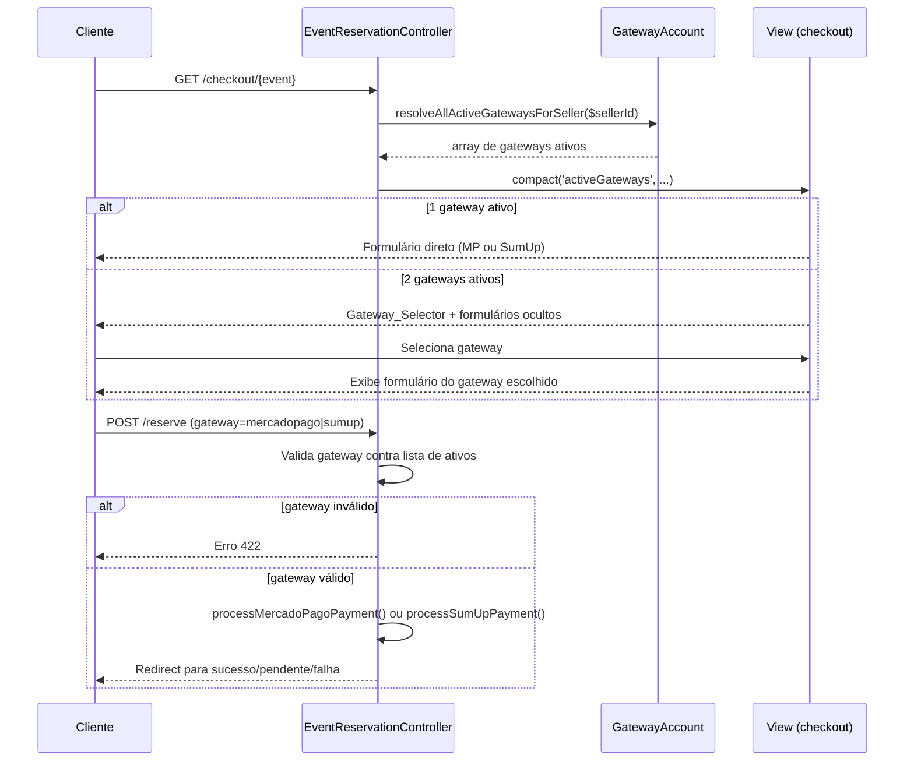

# Design: Multi-Gateway Checkout

## Visão Geral

Esta feature remove a restrição de exclusividade entre gateways de pagamento (Mercado Pago e SumUp), permitindo que ambos fiquem ativos simultaneamente. Quando dois gateways estão disponíveis para o vendedor de um evento, o checkout exibe um seletor visual para que o cliente escolha o provedor de sua preferência. Cada gateway passa a ter configurações independentes de métodos de pagamento, parcelamento e repasse de taxas.

O escopo de mudanças abrange:
- `GatewayAccount` — novo método `resolveAllActiveGatewaysForSeller()`
- `SettingController` — remoção da lógica de exclusividade, adição de validação de método mínimo e novas settings de parcelamento MP
- `EventReservationController` — roteamento por gateway selecionado pelo cliente
- Views de checkout — seletor visual de gateway
- Views de admin (ambos os painéis) — campos de parcelamento MP equivalentes aos do SumUp

---

## Arquitetura

O fluxo de checkout multi-gateway segue este caminho:

```
Cliente acessa checkout
        │
        ▼
EventReservationController::checkout()
        │
        ▼
GatewayAccount::resolveAllActiveGatewaysForSeller($sellerId)
        │
        ├─ [1 gateway] ──► Renderiza formulário direto (comportamento atual)
        │
        └─ [2 gateways] ─► Renderiza Gateway_Selector + formulários ocultos
                                    │
                                    ▼
                           Cliente seleciona gateway
                                    │
                                    ▼
                           EventReservationController::reserve()
                           Valida gateway no request
                                    │
                           ┌────────┴────────┐
                           ▼                 ▼
                    processMercadoPago  processSumUp
```



---

## Componentes e Interfaces

### 1. `GatewayAccount` — novo método

```php
/**
 * Retorna todos os gateways ativos para um vendedor.
 *
 * Prioridade por gateway:
 *   1. Credenciais do vendedor em gateway_accounts (enabled = true)
 *   2. Credenciais globais da plataforma (tabela settings)
 *
 * @return array<int, array{
 *   provider: string,
 *   enabled: bool,
 *   config: array,
 *   source: string
 * }>
 */
public static function resolveAllActiveGatewaysForSeller(int $sellerId): array
```

Comportamento:
- Itera sobre `['mercadopago', 'sumup']` e resolve cada um independentemente
- Para cada provider, aplica a mesma lógica de prioridade (seller → global) já existente
- Retorna apenas os gateways com `enabled = true` e credenciais válidas
- Se nenhum gateway estiver ativo, retorna `[]`

O método `resolveActiveGatewayForSeller()` existente é mantido para compatibilidade retroativa (usado em outros pontos do sistema), mas internamente pode delegar para o novo método.

### 2. `SettingController` — remoção da exclusividade

**Método `toggle()`**: remover o bloco que desativa o outro gateway ao ativar um.

**Método `update()`**: remover o bloco de validação de exclusividade (`if ($mpEnabled === 1 && $sumupEnabled === 1)`).

**Nova validação — método mínimo por gateway**: ao salvar configurações do grupo `gateway`, verificar que cada gateway ativo possui ao menos um método de pagamento ativo. Se a validação falhar, retornar HTTP 422 com mensagem `"Ao menos um método de pagamento deve permanecer ativo para este gateway."`.

**Novos campos de parcelamento MP** no `$groupBools` e nos loops de clamping:
- `mercadopago_max_installments` — inteiro [1, 12], padrão `12`
- `mercadopago_installments_no_interest` — inteiro [1, 12], padrão `1`
- `mercadopago_installment_tax` — float [0.00, 99.99], padrão `0.00`

**Novos campos de expiração do PIX** nos loops de clamping inteiro:
- `mercadopago_pix_expiration_minutes` — inteiro [1, 1440], padrão `10`
- `sumup_pix_expiration_minutes` — inteiro [1, 1440], padrão `10`

### 3. `EventReservationController` — roteamento por gateway

**Método `checkout()`**: substituir chamada a `resolveActiveGatewayForSeller()` por `resolveAllActiveGatewaysForSeller()`. Passar `$activeGateways` (array) para a view em vez de `$preferredGateway` (string).

**Método `reserve()`**: 
- Ler `$request->input('gateway')` quando há múltiplos gateways ativos
- Validar que o gateway informado está na lista de ativos do vendedor
- Se inválido, retornar erro 422
- Se há apenas 1 gateway ativo, usar esse diretamente (sem exigir o campo no request)
- Registrar `orders.gateway` com o identificador do gateway selecionado
- Logar `order_id`, `event_id` e `gateway` em cada transação

### 4. View `checkout/transparent.blade.php` — Gateway_Selector

A view recebe `$activeGateways` (array). Lógica de renderização:

```
count($activeGateways) === 1
  → renderiza formulário direto (comportamento atual, sem mudança visual)

count($activeGateways) === 2
  → renderiza Gateway_Selector acima dos formulários
  → cada formulário fica em div oculta, revelada ao selecionar o gateway
```

**Gateway_Selector** — estrutura HTML:
```html
<div id="gateway-selector" class="mb-8">
  <!-- Card MP -->
  <button type="button" id="btn-gateway-mercadopago" onclick="selectGateway('mercadopago')">
    <!-- logo + nome + métodos disponíveis -->
  </button>
  <!-- Card SumUp -->
  <button type="button" id="btn-gateway-sumup" onclick="selectGateway('sumup')">
    <!-- logo + nome + métodos disponíveis -->
  </button>
</div>

<input type="hidden" name="selected_gateway" id="selected_gateway" value="">

<div id="form-mercadopago" class="hidden"><!-- Payment Brick MP --></div>
<div id="form-sumup" class="hidden"><!-- SumUp Card Form --></div>
```

Função JS `selectGateway(provider)`:
- Atualiza `#selected_gateway`
- Oculta o seletor e exibe o formulário correspondente
- Exibe botão "Trocar gateway" para retornar ao seletor

### 5. Views de admin — campos de parcelamento MP

**Painel moderno** (`panel/admin/settings/partials/gateway.blade.php`):
- Na tab "Cobrança" do MP, substituir os campos genéricos (`gateway_installment_tax`, `gateway_max_installments_no_interest`, `gateway_pass_tax_to_client`) pelos campos específicos do MP:
  - `mercadopago_max_installments` (1–12)
  - `mercadopago_installments_no_interest` (1–12)
  - `mercadopago_installment_tax` (0.00–99.99%)
  - `mercadopago_pix_expiration_minutes` (1–1440 min, padrão 10)
  - `gateway_pass_tax_to_client` (mantido, é específico do MP)
- Remover o aviso de exclusividade de gateway

**Painel legado** (`admin/settings/partials/gateway.blade.php`):
- Na aba "Cobrança" do MP, adicionar os mesmos campos acima
- Remover o `alert-info` com a mensagem de exclusividade

**Seção SumUp — ambos os painéis**: adicionar campo `sumup_pix_expiration_minutes` (1–1440 min, padrão 10) na seção de configurações do SumUp, junto aos campos de parcelamento já existentes.

> **Nota de compatibilidade**: as chaves antigas `gateway_installment_tax` e `gateway_max_installments_no_interest` são mantidas na tabela `settings` para não quebrar código legado que ainda as leia. O checkout do MP passa a ler as novas chaves `mercadopago_*` com fallback para as antigas.

---

## Modelos de Dados

### Tabela `settings` — novas chaves

| Chave | Tipo | Padrão | Descrição |
|---|---|---|---|
| `mercadopago_max_installments` | int (1–12) | `12` | Máximo de parcelas no MP |
| `mercadopago_installments_no_interest` | int (1–12) | `1` | Parcelas sem juros no MP |
| `mercadopago_installment_tax` | float (0.00–99.99) | `0.00` | Taxa de juros por parcela no MP |
| `mercadopago_pix_expiration_minutes` | int (1–1440) | `10` | Expiração do PIX MP em minutos |
| `sumup_pix_expiration_minutes` | int (1–1440) | `10` | Expiração do PIX SumUp em minutos |

Não há migration necessária — a tabela `settings` é chave-valor e as novas chaves são inseridas via `Setting::set()` na primeira vez que o admin salva as configurações.

> **Compatibilidade retroativa**: a chave legada `pix_expiration_minutes` (usada pelo MP anteriormente) é mantida. O checkout do MP lê `mercadopago_pix_expiration_minutes` com fallback para `pix_expiration_minutes` e depois para `10`.

### Tabela `orders` — campo `gateway`

O campo `orders.gateway` já existe e já é preenchido com o provider. Nenhuma alteração de schema é necessária. A mudança é comportamental: quando há múltiplos gateways disponíveis, o valor passa a vir explicitamente do request do cliente em vez de ser inferido automaticamente.

### Estrutura do array retornado por `resolveAllActiveGatewaysForSeller()`

```php
// Exemplo com dois gateways ativos
[
    [
        'provider' => 'mercadopago',
        'enabled'  => true,
        'config'   => [
            'mpEnabled'    => true,
            'mpPublicKey'  => 'APP_USR-...',
            'mpAccessToken'=> 'APP_USR-...',
        ],
        'source'   => 'seller', // ou 'global'
    ],
    [
        'provider' => 'sumup',
        'enabled'  => true,
        'config'   => [
            'sumupEnabled' => true,
            'apiKey'       => '...',
            'merchantCode' => '...',
        ],
        'source'   => 'seller',
    ],
]
```

---

## Propriedades de Correção

*Uma propriedade é uma característica ou comportamento que deve ser verdadeiro em todas as execuções válidas do sistema — essencialmente, uma declaração formal sobre o que o sistema deve fazer. Propriedades servem como ponte entre especificações legíveis por humanos e garantias de correção verificáveis por máquina.*

### Propriedade 1: Independência de estado entre gateways

*Para qualquer* combinação de valores (0 ou 1) de `mercadopago_enabled` e `sumup_enabled`, salvar o estado de um gateway não deve alterar o estado do outro gateway na tabela `settings`.

**Valida: Requisitos 1.1, 1.2**

---

### Propriedade 2: Correspondência exata entre gateways ativos e array retornado

*Para qualquer* vendedor e qualquer subconjunto de `{mercadopago, sumup}` configurado como ativo (com credenciais válidas), `resolveAllActiveGatewaysForSeller()` deve retornar um array cujos providers correspondem exatamente ao subconjunto ativo — nem mais, nem menos.

**Valida: Requisitos 1.5, 2.2, 2.3, 2.4**

---

### Propriedade 3: Presença do seletor condicionada ao número de gateways

*Para qualquer* checkout renderizado, o Gateway_Selector deve aparecer se e somente se `count($activeGateways) === 2`. Com exatamente 1 gateway ativo, o seletor não deve aparecer e o formulário deve ser exibido diretamente.

**Valida: Requisitos 3.1, 3.2**

---

### Propriedade 4: Roteamento de pagamento pelo gateway selecionado

*Para qualquer* gateway válido em `['mercadopago', 'sumup']` informado no request, o `EventReservationController` deve chamar exclusivamente o serviço de pagamento correspondente a esse gateway e registrar o mesmo identificador em `orders.gateway`.

**Valida: Requisitos 3.7, 9.1, 9.2**

---

### Propriedade 5: Rejeição de gateway inválido

*Para qualquer* gateway informado no request que não esteja na lista de gateways ativos para o vendedor no momento do processamento, o `EventReservationController` deve rejeitar o pagamento com erro, sem processar nenhuma cobrança.

**Valida: Requisito 9.3**

---

### Propriedade 6: Clamping de valores de parcelamento

*Para qualquer* valor inteiro enviado para `mercadopago_max_installments`, `mercadopago_installments_no_interest`, `sumup_max_installments` ou `sumup_installments_no_interest`, o `SettingController` deve persistir um valor no intervalo `[1, 12]`. *Para qualquer* valor float enviado para `mercadopago_installment_tax` ou `sumup_installment_tax`, o valor persistido deve estar no intervalo `[0.00, 99.99]`.

**Valida: Requisitos 5.5, 5.6**

---

### Propriedade 7: Cálculo correto do valor de parcela

*Para qualquer* combinação de (valor total > 0, número de parcelas n ∈ [1, 12], taxa de juros t ∈ [0.00, 99.99], limite sem juros k ∈ [1, 12]):
- Se `n <= k`: valor por parcela = `total / n` (sem juros)
- Se `n > k` e `passFeeToClient = true`: valor por parcela = `total * (1 + t/100) / n`
- Se `n > k` e `passFeeToClient = false`: valor por parcela = `total / n` (juros absorvidos)

**Valida: Requisitos 5.7, 5.8, 6.5, 6.6**

---

### Propriedade 8: Validação de método mínimo por gateway

*Para qualquer* gateway ativo, se todos os seus métodos de pagamento estiverem desativados exceto um, tentar desativar o último método deve ser rejeitado pelo `SettingController` com erro, mantendo o estado anterior inalterado.

**Valida: Requisito 4.5**

---

### Propriedade 9: Persistência independente de flags de método

*Para qualquer* combinação de valores (0 ou 1) das flags de método de pagamento de qualquer gateway, o `SettingController` deve persistir cada flag com seu valor exato, sem interferência entre flags de gateways diferentes.

**Valida: Requisitos 4.6, 8.3, 8.4**

---

### Propriedade 10: Clamping do tempo de expiração do PIX

*Para qualquer* valor inteiro enviado para `mercadopago_pix_expiration_minutes` ou `sumup_pix_expiration_minutes`, o `SettingController` deve persistir um valor no intervalo `[1, 1440]`. Valores menores que 1 devem ser corrigidos para `1`; valores maiores que 1440 devem ser corrigidos para `1440`.

**Valida: Requisitos 10.5, 10.6**

---

## Tratamento de Erros

### Gateway não configurado para o vendedor
- Comportamento atual mantido: redireciona para a página do evento com mensagem de erro
- Condição: `resolveAllActiveGatewaysForSeller()` retorna array vazio

### Gateway inválido no request
- HTTP 422 com mensagem: `"Gateway de pagamento inválido ou não disponível para este evento."`
- Nenhuma cobrança é processada
- Log de warning com `order_id`, `event_id`, `gateway_informado`, `gateways_ativos`

### Ausência do campo `gateway` com múltiplos gateways
- HTTP 422 com mensagem de validação: `"O campo gateway é obrigatório quando há múltiplos gateways disponíveis."`
- Validação feita antes de qualquer operação de banco de dados

### Falha ao salvar configuração com método mínimo violado
- HTTP 422 com mensagem: `"Ao menos um método de pagamento deve permanecer ativo para este gateway."`
- Nenhuma configuração é alterada (validação antes do `Setting::set()`)

### Compatibilidade retroativa — chaves antigas de parcelamento MP
- O checkout do MP lê `mercadopago_installment_tax` com fallback para `gateway_installment_tax`
- O checkout do MP lê `mercadopago_max_installments` com fallback para `gateway_max_installments_no_interest` (para o campo de máximo de parcelas)
- Isso garante que instalações existentes continuem funcionando sem reconfiguração imediata

---

## Estratégia de Testes

### Testes unitários (PHPUnit)

Cobrem comportamentos específicos e casos de borda:

- `GatewayAccount::resolveAllActiveGatewaysForSeller()` com 0, 1 e 2 gateways ativos
- Fallback para credenciais globais quando o vendedor não tem gateway configurado
- `SettingController::toggle()` — salvar um gateway não altera o outro
- `SettingController::update()` — validação de método mínimo por gateway
- `SettingController::update()` — clamping de valores de parcelamento
- `EventReservationController::reserve()` — rejeição de gateway inválido
- `EventReservationController::reserve()` — exigência do campo `gateway` com múltiplos gateways

### Testes de propriedade (PBT com PestPHP + `pest-plugin-arch` ou `eris`)

A biblioteca recomendada é **[eris](https://github.com/giorgiosironi/eris)** (PHP) ou, alternativamente, os geradores manuais do PestPHP com `it()->repeat(100)`. Cada teste de propriedade deve rodar no mínimo **100 iterações**.

Tag de referência: `Feature: multi-gateway-checkout, Property {N}: {texto}`

**Propriedade 1** — Independência de estado entre gateways:
```php
// Feature: multi-gateway-checkout, Property 1: gateway state independence
// Gerar pares aleatórios (0|1, 0|1) para (mp_enabled, sumup_enabled)
// Salvar mp_enabled, verificar que sumup_enabled não mudou, e vice-versa
```

**Propriedade 2** — Correspondência exata do array de gateways:
```php
// Feature: multi-gateway-checkout, Property 2: active gateways array match
// Gerar subconjunto aleatório de {mercadopago, sumup} como ativos
// Verificar que resolveAllActiveGatewaysForSeller() retorna exatamente esse subconjunto
```

**Propriedade 4** — Roteamento pelo gateway selecionado:
```php
// Feature: multi-gateway-checkout, Property 4: payment routing by selected gateway
// Para qualquer gateway em ['mercadopago', 'sumup'], verificar que o serviço correto é chamado
// e que orders.gateway = gateway selecionado
```

**Propriedade 5** — Rejeição de gateway inválido:
```php
// Feature: multi-gateway-checkout, Property 5: invalid gateway rejection
// Gerar strings aleatórias que não sejam gateways ativos do vendedor
// Verificar que o controller rejeita com erro sem processar cobrança
```

**Propriedade 6** — Clamping de parcelamento:
```php
// Feature: multi-gateway-checkout, Property 6: installment value clamping
// Gerar inteiros aleatórios (incluindo negativos e > 12) para campos de parcelas
// Gerar floats aleatórios (incluindo negativos e > 99.99) para taxa
// Verificar que o valor persistido está dentro dos limites
```

**Propriedade 7** — Cálculo de parcela:
```php
// Feature: multi-gateway-checkout, Property 7: installment calculation
// Gerar (total > 0, n ∈ [1,12], taxa ∈ [0,99.99], k ∈ [1,12], passFee ∈ {true,false})
// Verificar a fórmula correta para cada combinação
```

**Propriedade 8** — Validação de método mínimo:
```php
// Feature: multi-gateway-checkout, Property 8: minimum payment method validation
// Para qualquer gateway com exatamente 1 método ativo, tentar desativar deve retornar erro
```

**Propriedade 9** — Persistência independente de flags:
```php
// Feature: multi-gateway-checkout, Property 9: independent method flag persistence
// Gerar combinações aleatórias de flags de método para ambos os gateways
// Verificar que cada flag é persistida com seu valor exato
```

**Propriedade 10** — Clamping de expiração do PIX:
```php
// Feature: multi-gateway-checkout, Property 10: PIX expiration clamping
// Gerar inteiros aleatórios (incluindo negativos, 0 e > 1440) para os campos de expiração
// Verificar que o valor persistido está no intervalo [1, 1440]
```

### Testes de integração

- Fluxo completo de checkout com 1 gateway ativo (regressão)
- Fluxo completo de checkout com 2 gateways ativos (novo)
- Salvamento de configurações de gateway em ambos os painéis
- Webhook de confirmação de pagamento com `orders.gateway` correto

### Testes de UI (manual ou browser)

- Gateway_Selector responsivo em 320px, 768px e 1280px
- Alternância entre formulários MP e SumUp no checkout
- Botão "Trocar gateway" retorna ao seletor
- Aviso de exclusividade ausente em ambos os painéis
